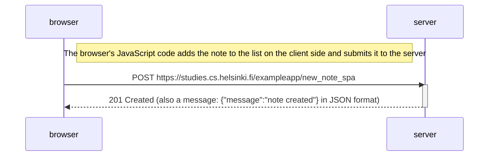

```mermaid
sequenceDiagram
  participant browser
  participant server

  Note right of browser: The browser's JavaScript code adds the note to the list on the client side and submits it to the server

  browser->>server: POST https://studies.cs.helsinki.fi/exampleapp/new_note_spa
  activate server
  server-->>browser: 201 Created (also a message: {"message":"note created"} in JSON format)
  deactivate server

```
